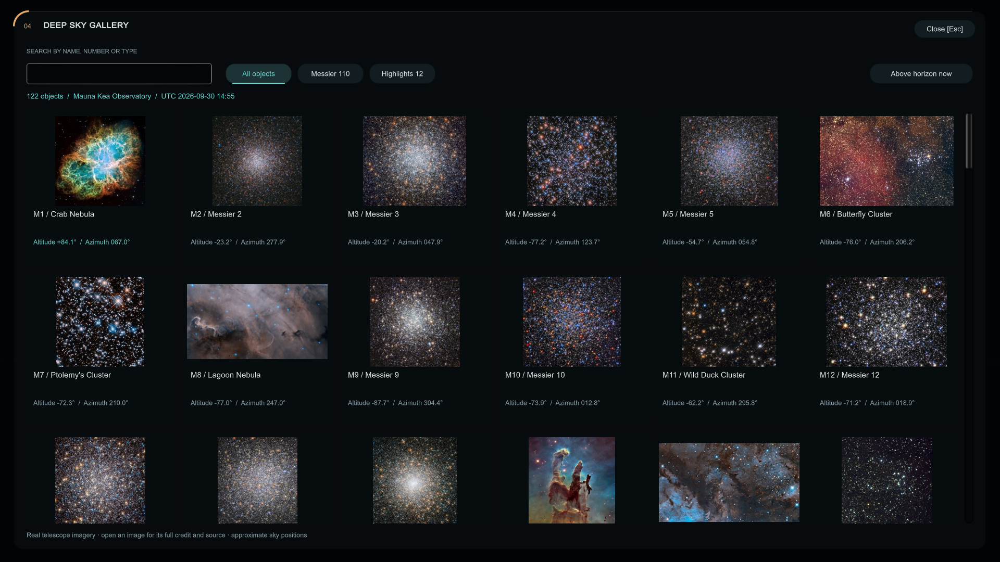

# Astronautica / Cosmic Explorer

A native Windows Unity application for exploring four cosmic scales, comparing constant-speed travel times, and browsing a local celestial catalog. The interface is an original spacecraft survey console, with open views, restrained amber and teal instruments, and curved navigation marks.

**[Download the Windows installer or portable ZIP](https://github.com/XayerMorgan/galactic_view/releases/latest)** · **[User guide](docs/USER_GUIDE.md)** · **[Build from source](docs/BUILDING.md)**

Windows 10 (21H1+) / 11, x64, with DirectX 11-capable graphics. All 122 gallery photographs, the nine-track soundtrack and help are bundled for offline use. The installer works per-user without administrator access and includes Start menu shortcuts and an uninstaller. The initial release is unsigned; SHA256 checksums accompany the downloads.

Original code and documentation are **MIT licensed**; [third-party notices](THIRD_PARTY_NOTICES.md) cover telescope imagery, catalog data, generated audio, artwork and Unity separately.



## Run

Install the release and launch **Astronautica** from the Start menu, or extract the complete portable ZIP and run `CosmicZoomEngine.exe`. Press **F1** or choose **Settings → Help & field guide** for the offline illustrated guide. No Unity editor is required to run a release.

Double-click `START_COSMIC_ZOOM.bat` (or `RUN_APP.bat`). The launcher opens `CosmicZoomEngine_App/CosmicZoomEngine.exe`. The build is local and is not committed to Git.

This repository currently contains a **Unity desktop app**, not the browser/WebGL app described in earlier revisions of this README. There is no `index.html` to serve.

## Explore

| Control | Action |
| --- | --- |
| 1–4 / navigation sectors | Select solar system, Milky Way, local group, or cosmic web |
| Left or right drag in the viewport | Orbit a target; look around in the observatory |
| Mouse wheel in the viewport | Inspect closer/farther; adjust telescope field of view |
| Arrow keys | Orbit / look around |
| Target buttons in Navigation | Track a body, galaxy, or overview |
| R | Reset the current sector, or restore the sky horizon overview |
| Space | Emit / restart an illustrative light pulse |
| T | Start / stop the narrated tour |
| S | Enter / leave the observatory |
| G / Gallery | Open the offline telescope image gallery |
| F1 / Settings → Help & field guide | Open the offline user guide in your browser |
| H | Cycle full, quiet, and cinematic views |
| U | Cycle metric, miles, and dual units |
| Escape | Close the gallery/preferences, return from observatory, or exit the app |

Settings contains text scale, contrast, units, narration, and a nine-track music player with pause, next, shuffle, volume, and global mute. Five new three-minute space instrumentals join the original four acoustic tracks. The new suite is normalized to approximately -20 LUFS with protected peaks; music streams from disk, crossfades between tracks, and ducks beneath narration. Side instruments can collapse. Both docks scroll when their contents exceed the available height. Scrolling or dragging a dock does not move the camera.

The Sky tab lets you browse without entering the observatory. **Observatory [S]** opens a wide southern horizon with a layered landscape, atmospheric rim and compass directions. Drag or use arrow keys to look around; the camera stays level with the local horizon. Use cardinal-direction buttons, zoom controls, or **Horizon overview [R]** to reorient. Selecting an above-horizon catalog row aims immediately. The catalog can show above-horizon targets or all targets; below-horizon targets remain available for information. Pick an observer preset for altitude/azimuth at the current UTC time. The ground occludes objects below the horizon. Constellations, horizon, object markers, and star labels can be toggled independently.

## What the visualization represents

**Gallery:** all 110 Messier objects and 12 selected deep-sky highlights, each with a locally bundled telescope photograph, thumbnail, credit, original source and usage link. Search by name, Messier/NGC identifier, constellation or type; filter to Messier, highlights, or objects above the horizon. Open an image for its altitude/azimuth and **Locate in the sky**. Altitude is measured from the horizon, azimuth clockwise from north. Observer presets and custom latitude/longitude are available under **Sky → Change observer location**; north/east coordinates are positive. Positions update for the current UTC time using approximate J2000 coordinates without precession or refraction; they are suitable for orientation, not precision telescope guidance.

The highlights are the North America, Helix, Carina, Western Veil, Bubble, Rosette and Tarantula nebulae, NGC 2392, 47 Tucanae, Omega Centauri, Centaurus A and NGC 869 in the Double Cluster. Telescope photographs can show a detail or surrounding field. M102 uses the traditional, historically disputed NGC 5866 identification. The image collection is separate from the schematic 3D Local Group.

- **Solar system:** Sun, Earth, Jupiter, Saturn and Neptune. The span is Neptune's **orbital diameter** (60.14 AU), not the Sun-to-Neptune radius. Body sizes and orbital spacing are schematic.
- **Milky Way:** a textured galactic disk, core and tracked solar-position beacon; a 100,000-light-year benchmark span.
- **Local group:** a two-galaxy schematic containing only Milky Way and Andromeda models; a 10-million-light-year benchmark span. This is **not a complete Local Group**: Triangulum (M33) and the dwarf galaxies are not included.
- **Cosmic web:** an illustrative textured filament disk and transparent particle-horizon boundary; a 93-billion-light-year benchmark span.
- **Observatory:** a curated celestial catalog, constellation lines, and local horizon. Catalog coordinates are tied to the observer and time; the background star field and landscape are decorative. Daylight, weather and atmospheric refraction are not modeled. This is a coordinate/targeting view, not a photographic telescope image.

Travel times use distance / speed in the observer's frame, without acceleration, relativistic proper-time correction, or cosmic expansion. The light pulse illustrates progress over ten playback seconds at 1x; its numerical transit time is shown separately. Cosmic-scale results are static-distance comparisons, not predictions of an achievable journey.

## Develop and build

Image sources: [NASA's Hubble Messier catalog](https://science.nasa.gov/mission/hubble/science/explore-the-night-sky/hubble-messier-catalog/) and Caldwell pages, supplemented by [NOIRLab](https://noirlab.edu/public/images/). Per-image credits and terms are retained in the app and `Assets/StreamingAssets/Gallery/CREDITS.txt`. NASA/Hubble usage guidelines and NOIRLab's CC BY 4.0 terms apply per image; these are not blanket claims that every NASA-hosted image is public domain. Coordinates and classifications are an adapted [OpenNGC](https://github.com/mattiaverga/OpenNGC) subset, CC BY-SA 4.0; its license is bundled with the gallery. Generated instrumental provenance and prompts are recorded in `asset_pipeline/`.

Rebuild the gallery with `python asset_pipeline/build_deep_sky_gallery.py` (requests, beautifulsoup4, Pillow). OpenNGC is pinned to a revision; downloaded responses are cached locally. Explicit source overrides identify the supplemental images. `python asset_pipeline/normalize_music.py` reproduces the audio leveling using imageio-ffmpeg and preserves originals in the ignored cache.

- Unity **6000.6.0f1** (see `unity_cosmic_engine/ProjectSettings/ProjectVersion.txt`).
- `launch_unity.bat` opens the Unity project using the installed editor.
- `Assets/Scripts/Editor/CosmicSceneBuilder.cs` assembles the scene and materials from the imported FBX assets. It is the source of truth for scene generation; changes made only to the generated scene can be overwritten on rebuild.
- `Assets/Scripts/CosmicHUD.cs` owns HUD layout and input regions; `CosmicConsoleDrawing.cs` draws instruments.
- `CosmicZoomEngine.cs` owns flight input and sector selection; `CelestialMessierCatalog.cs` owns telescope movement.
- `Assets/Resources/CosmicRim.shader` and `CosmicAdditive.shader` are included in player builds for atmospheric rims and transparent luminous artwork.

Build from PowerShell (adjust the Unity executable path if needed):

```powershell
& 'C:/Program Files/Unity/Hub/Editor/6000.6.0f1/Editor/Unity.exe' `
  -batchmode -quit -projectPath "$PWD/unity_cosmic_engine" `
  -executeMethod CosmicZoom.Editor.CosmicSceneBuilder.BuildStandalonePlayer `
  -logFile "$PWD/unity_cosmic_engine/interface-build.log"
```

## Verify the actual player

```powershell
& './CosmicZoomEngine_App/CosmicZoomEngine.exe' --cosmic-qa `
  -logFile "$PWD/unity_cosmic_engine/runtime-verification.log"
```

The opt-in runner exercises stage visibility, nested target tracking, atmosphere bounds, supported shaders, pulse pause/cancellation, observatory entry/return, sky filters, horizon coordinate agreement, independent altitude/azimuth fixtures, compass orientation, aim accuracy, zoom limits, and reset behavior. It also verifies every Messier ID, all 122 image/thumbnail pairs and credits, gallery search/modal behavior, all nine music tracks, streaming, shuffle, pause/resume and mute during skipping. It captures the full rendered HUD and gallery at 1920×1080, 1280×720 with enlarged text, and 2560×1080. Results and PNGs go to `visual_tests/interface-repair/`; a nonzero exit code means a failed assertion or runtime error. The runner never executes during ordinary app use.

The older editor menu **Capture Scene-Only Reference Screenshots** writes camera-only images to `visual_tests/scene-only/`. Those images do not exercise runtime scripts or include the HUD and cannot validate the interface.

## Art direction still to develop

The repaired console provides the functional foundation. Existing galaxy and planet textures are retained; the two survey ships are removed from the app. Some galaxy artwork has labels baked into its texture, and the web is still a flat illustrative layer. A future art pass can replace these with richer spatial assets and develop the console's original visual language without copying a franchise interface.
